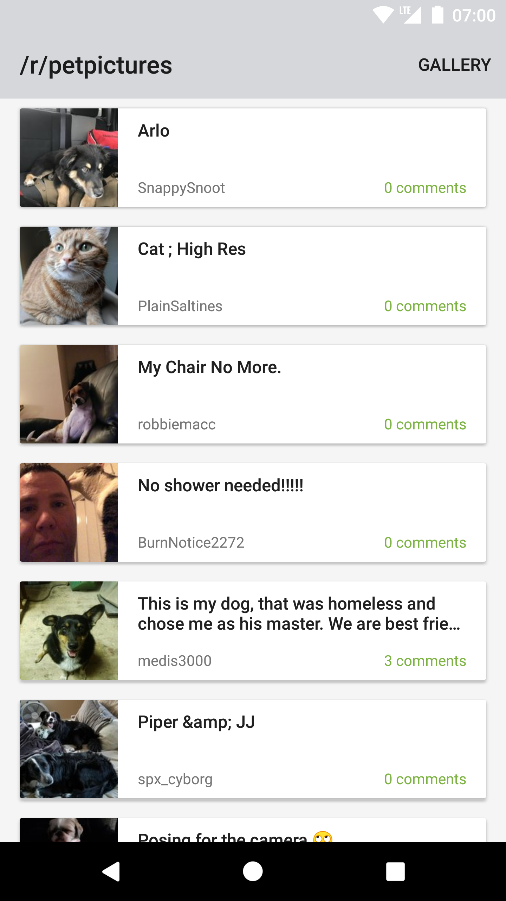

# reddit_viewer

Reddit Viewer is a port of the Tabris.js Reddit Pets example to TypeScript.

It fetches data from the [/r/petpictures subreddit](https://www.reddit.com/r/petpictures/) and renders it in a Tabris.js [CollectionView](https://tabrisjs.com/documentation/latest/api/CollectionView.html). An [Action](https://tabrisjs.com/documentation/latest/api/Action.html) is used to switch between two display modes of the items, a list and a gallery mode.

|List mode|Gallery mode|
|---|---|
|||

The project uses [Tabris.js Decorators](github.com/eclipsesource/tabris-decorators) on top of Tabris.js, which provides useful TypeScript decorators replacing repetetive code common in app development. Features used in the example:

* [**`@getById private myWidgetId: TextView;`**](https://github.com/eclipsesource/tabris-decorators/tree/371fab73cf4b9eafdd8d16a20d11673a4ede0dbf#getbyid)

  Sets the field to a widget (created in the class constructor) with an ID matching its name.

* [**`@getByType private collectionView: CollectionView;`**](https://github.com/eclipsesource/tabris-decorators/tree/371fab73cf4b9eafdd8d16a20d11673a4ede0dbf#getbytype)

  Sets the field to the first widget (created in the class constructor) with a matching type.
  
* [**`@property private myProperty: string;`**](https://github.com/eclipsesource/tabris-decorators/tree/371fab73cf4b9eafdd8d16a20d11673a4ede0dbf#property)

  Makes the field a Tabris.js widget property, which can be used via the constructor and with [`set()`](https://tabrisjs.com/documentation/latest/api/NativeObject.html#setproperty-value) and [`get()`](https://tabrisjs.com/documentation/latest/api/NativeObject.html#getproperty). 
  
* [**`@component`**](https://github.com/eclipsesource/tabris-decorators/tree/371fab73cf4b9eafdd8d16a20d11673a4ede0dbf#component)

  Ensures proper component encapsulation. Widget retrieval functions operating on the widget graph like [find()](https://tabrisjs.com/documentation/latest/api/WidgetCollection.html#findselector) and [children()](https://tabrisjs.com/documentation/latest/api/WidgetCollection.html#childrenselector) will ignore children of this component. Also enables JSX-based one-way data binding.
  
* **One-way data binding**
  

    When using `@property private myProperty: string;` in conjunction with:
  
    ```
     <textView
       bind-text='myProperty'
       ... />
    ```
    ... the `text` property of the `TextView` will be updated when `myProperty` is updated.
    
    
    *\* Two-way data binding is also supported using the [`@bind("#<id>.<property>")`](https://github.com/eclipsesource/tabris-decorators/tree/371fab73cf4b9eafdd8d16a20d11673a4ede0dbf#bindidproperty) decorator.*

## Run

In the project directory, run the [Tabris CLI](https://www.npmjs.com/package/tabris-cli) command:

```
tabris serve
```

This will start a JavaScript app code server at a free port and print its URL to the console.

The JavaScript app code can be [side-loaded](https://tabrisjs.com/documentation/2.0/developer-app.html#the-developer-console) in the [developer app](https://tabrisjs.com/documentation/2.0/developer-app.html) if the default config.xml was not changed. Otherwise, the JavaScript app code must be side-loaded in a [debug build](https://tabrisjs.com/documentation/2.0/build.html#building-a-tabrisjs-app) of this app.
 
## Build

The app can be built using the online build service at [tabrisjs.com](https://tabrisjs.com) or locally using [Tabris.js CLI](https://www.npmjs.com/package/tabris-cli).

See [Building a Tabris.js App](https://tabrisjs.com/documentation/2.0/build.html) for more information.

## Authors

[@tbuschto](https://github.com/tbuschto)
[@dbuschtoens](https://github.com/dbuschtoens)
